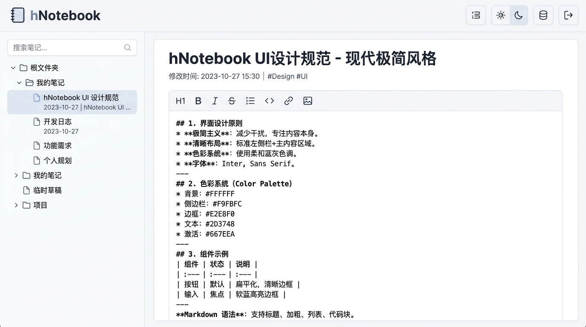
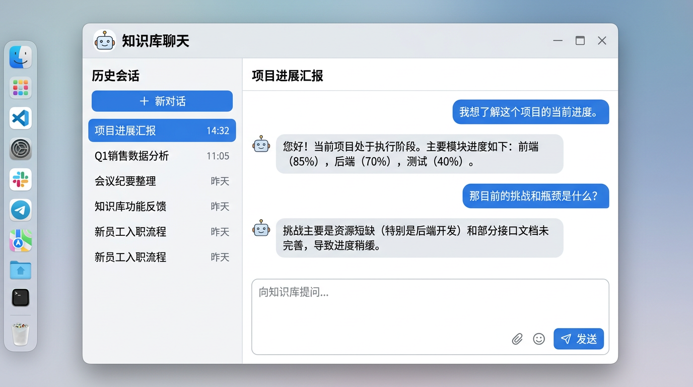
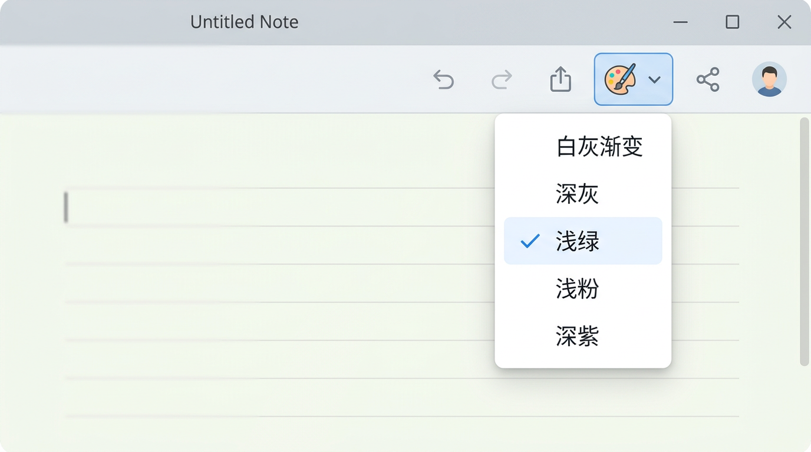

# hNotebook

**hNotebook** is a personal knowledge-base style notebook: **React + Vite** SPA, **Spring Boot** API for notes/folders/tags/auth, and a **FastAPI** RAG service (OpenAI-compatible embeddings & chat). The browser keeps a **local-first** copy in **IndexedDB** with offline edits and **LWW** sync when online.

**Languages:** English (this file) · [简体中文](README.zh-CN.md)

---

## Features

- **Notes & Markdown** — Edit in Markdown; sidebar tree with folders; search by title/body.
- **Auth** — Register / login with JWT; data scoped per user.
- **Offline-friendly** — IndexedDB mirror + outbox; sync when connected; LWW merge with server `updatedAt`.
- **Knowledge base (RAG)** — Ingest notes into a vector index, chat with history sessions, configurable models (UI + env).
- **Themes** — Multiple UI presets (light/dark-tinted palettes); accent-aware chrome.
- **Docker** — Compose stack with nginx gateway (`/api`, `/rag`) on port **8080**.

---

## Screenshots

Illustrative UI captures for this README (replace files under [`docs/screenshots/`](docs/screenshots/) with your own if you want pixel-accurate shots of your build).

<p align="center">
  <b>Workspace</b> — folders, search, Markdown editor<br />
  
</p>

<p align="center">
  <b>Knowledge base chat</b> — sessions, messages, question box<br />
  
</p>

<p align="center">
  <b>Themes</b> — preset picker (palette)<br />
  
</p>

---

## Tech stack

| Layer | Stack |
|-------|--------|
| Frontend | React 19, TypeScript, Vite 6, Dexie (IndexedDB), react-markdown |
| API | Java 21, Spring Boot, JWT, H2 (file) by default |
| RAG | Python 3.12+, FastAPI, Uvicorn |
| Deploy | Docker Compose, nginx gateway |

---

## Repository layout

| Path | Description |
|------|-------------|
| `apps/web` | Web app; dev server proxies `/api` and `/rag` |
| `services/api` | Java API, context path **`/api`** |
| `services/rag` | Python RAG service |
| `deploy/` | `docker-compose.yml` + gateway image |
| `contracts/` | Optional OpenAPI / shared schemas |
| `docs/` | Architecture, local development, [`screenshots/`](docs/screenshots/) for README images |
| `scripts/` | Helper scripts (e.g. Windows `dev.ps1`) |

---

## Prerequisites

- **Node.js** 20+
- **JDK 21** + **Maven 3.9+** (for `services/api`), *or* build/run API via Docker
- **Python 3.12+** (for `services/rag`)
- **Docker** (optional, for Compose)

---

## Quick start

### Option A — Docker (API + RAG gateway)

From the repo root:

```bash
cd deploy
docker compose up --build
```

- API health: `http://127.0.0.1:8080/api/health`
- RAG health: `http://127.0.0.1:8080/rag/health`

Set `OPENAI_API_KEY` (and optionally `OPENAI_BASE_URL`, models) for real embeddings/chat. The UI is usually run with **Vite** during development (see below).

### Option B — Local (three terminals)

Typical order: **Java API → RAG → Vite**.

```bash
# 1) API
cd services/api && mvn spring-boot:run

# 2) RAG
cd services/rag
python -m venv .venv && .venv\Scripts\activate   # Windows
# source .venv/bin/activate                        # macOS / Linux
pip install -r requirements.txt
uvicorn app.main:app --reload --host 127.0.0.1 --port 8000

# 3) Web
cd apps/web && npm install && npm run dev
```

Open the URL Vite prints (commonly `http://127.0.0.1:5173`).

**Details & troubleshooting:** [docs/local-dev.md](docs/local-dev.md)

---

## Configuration notes

- **JWT:** Default secret in `application.yml`. For production, set **`HNOTEBOOK_JWT_SECRET`** (≥ 32 bytes). Compose sets a dev placeholder — **change it** before any real deployment.
- **RAG:** Configure Base URL, API key, and models in the in-app **知识库配置** panel, or via environment variables in Compose (see `deploy/docker-compose.yml`).
- **Local-first:** Data lives in the browser DB named `hnotebook`. Folder/tag mutations that require server rules may still need connectivity.

---

## Documentation

| Doc | Content |
|-----|---------|
| [docs/local-dev.md](docs/local-dev.md) | Prerequisites, commands, tips (incl. 中文) |
| [docs/architecture.md](docs/architecture.md) | Boundaries and evolution ideas |

---

## License

This is a **personal GitHub project**. Add a `LICENSE` file when you are ready to publish under a specific terms.

---

<p align="center">
  <a href="README.zh-CN.md">→ 简体中文说明</a>
</p>
